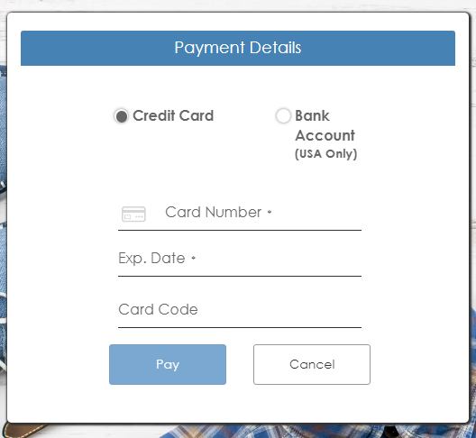
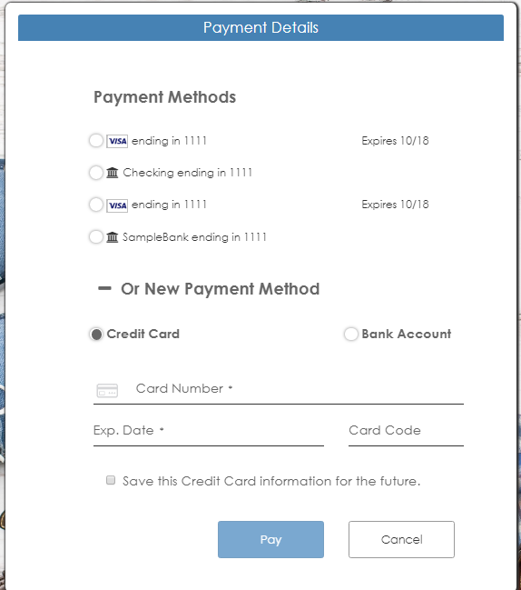

# Accept Hosted Step by Step

## Description

Accept Hosted provides a fully hosted, mobile-optimized payment form that uses an iframe for redirect or direct post of cardholder data to Authorize.Net.

Passing customer profile ID is optional in case of Accept Hosted. We must allow the developer to access Accept Hosted product type screen with or without passing customer profile ID. 

If a customer wants to send customer ID, it should be passed as a query string in the URL. The payment form will be displayed only if it is a valid customer ID.

For example, customer ID should be passed as below,
https://10.173.192.248:5008/index.html?producttype=accepthosted&customerid=1813212446

## Workflow

1. On loading of the page, Requesting token by calling the Authorize.Net API "Get Hosted Payment Page Request" by using the parameter AcceptHostedRequestUrl in constants file.
As a response token is received.

2. We will embed the payment form in the web page using an iframe. 

A form is submitted by passing the received token as an input to the HostedFormUrl which needs to embed in an iframe.

3. The hosted Payment form is displayed automatically when the form is posted.

Accept Hosted will have Credit card and Bank account as payment options.
When accessing Accepted Hosted product type if customer profile ID is passed via Query string, we are displaying four most recent payment profiles associated with the customer profile ID. The customer can choose between these payment methods or choose to use a new payment method. 

Payment Form contains Pay and Cancel buttons, when we click on Pay button the payment happens in the background and when we click on Cancel, it will redirect to dashboard page. Based on response a confirmation page is displayed.

##Iframe Communicator

IFrameCommunicator is a small html page hosted on domain containing a JavaScript that listens for events we can receive inputs related to response and this parameter has to be set in hostedPaymentSettings.

When payment hosted form is embedded in an Iframe, hosted payment form can in turn embed IFrameCommunicator page within it inside an invisible Iframe. This enables a channel of communication that allows to send messages to IFrameCommunicator page. Then, as long as IFrameCommunicator page is hosted on the same domain as main page, it can communicate back to main page.

This channel of communication is used to pass a few basic messages back to a listener script running on main page (the page that calls the form):
*	Ideal height and width of the window - enables you to resize the frame and avoid any scrollbars from appearing.
*	Request Succeeded - returned when the transaction is completed at Authorize.Net. You can use this notification to know when to look for those changes through the Transaction Reporting API. Transaction response parameters (such as transaction ID) are returned with this notification.
*	Request Cancelled - returned when the customer cancels the hosted form.

