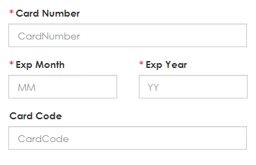
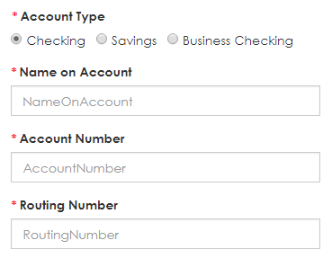
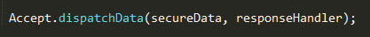
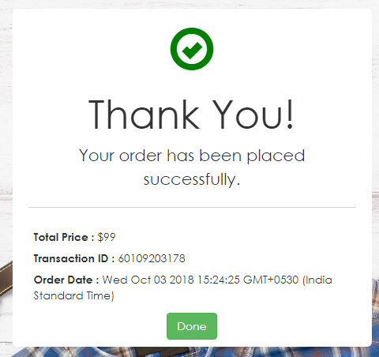

# Accept.js Description

Accept.js is a JavaScript-based solution for sending secure payment data directly to Authorize.Net. The Accept JavaScript library intercepts the payment data before it is passed to merchant server and instead submits it directly to Authorize.Net.

## Workflow

Accept.js accepts both card and bank payments. A screen/form is created with the below mentioned fields for card and bank payment with required validations.  

### Card Payment Fields

### Bank Payment Fields

Shopping cart information is also provided beside the payment form with static content.

Accept JS plugin has been developed by the VISA Team and Dispatch Data functionality is already present in that plugin. Accept.js extracts the payment details from customer’s form and sends them directly from the customer's web browser to Authorize.Net, which returns a payment nonce/token.
A response handler function is written to handle the response of Dispatch Data functionality.

After receiving the payment nonce / token, we will pass this token and other required details like ApiLoginID, ApiTransactionKey and AcceptJSRequestUrl to Accept JS web API. Based on the response code whether Success / Failed we will read the response and will display the confirmation page on the screen with details like transaction ID and transaction date.

