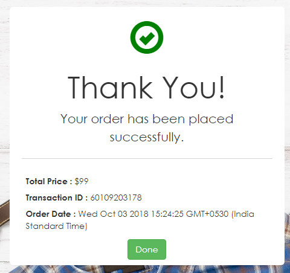

# Accept.js with UI Description

In this we embed the built-in ANET hosted form in our application to capture and send sensitive payment information directly to Authorize.Net.

## Workflow

Shopping cart information is displayed on the page by default. A Pay button is defined on the page and when the customer clicks the button a pop up with built-in hosted Payment form is opened. 
There is a predefined angular directive for the button, we just need to fill the values for button.

Below is the screenshot of existing payment form for Accept.js with UI.

The customer fills the payment information in the form, and clicks the pay button.The Accept script sends the payment information directly to Authorize.Net and receives a payment nonce. 

The script passes the payment nonce to the response handler function for the button which we have defined and from response handler function we will receive the payment nonce/token.

After receiving the payment nonce / token, we will pass this token along with other non payment details to the web API through Ajax call passing AcceptJSRequestUrl as parameter.

Based on the response code whether Success / Failed we will read the response and will display the confirmation page on the screen.

