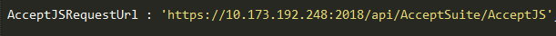

# Accept Suite Integration

## prerequisite:
*	Windows 10 Professional
*	Sublime Text or any editor of your choice.
*	Internet Information Services 10

## Product type description.

Authorized.Net Accept suite has below products.
*	Accept JS
*	Accept UI
*	Accept Hosted
*	Accept Customer

Detailed explanation of each product are available in the below links.
https://developer.authorize.net/api/reference/features/accept.html
https://developer.authorize.net/api/reference/features/acceptjs.html
https://developer.authorize.net/api/reference/features/accept_hosted.html
https://developer.authorize.net/api/reference/features/customer_profiles.html#Using_the_Accept_Customer_Hosted_Form

## Integration

* Clone the Repository or Download the source code to local folder.

### Constants File Description

* Constants.js file contains Parameters that are used in the application.

* AcceptJSRequestUrl : URL to invoke Accept JS web service on payment.

* AcceptHostedRequestUrl : URL to get the token value for Accept Hosted.

* AcceptCustomerRequestUrl : URL to get the token value for Accept Customer.

* ValidateCustomerRequestUrl : URL to invoke a web api method to validated customer ID.
 

 
The following are the parameters with values that remains constant throughout the application. These parameters are used in script through Ajax calls for performing payments.

* ClientKey 
* ApiLoginID
* ApiTransactionKey

### Steps to create Website on IIS

*	Open IIS as Administrator.

*	Right click on sites and select “Add Website”. 

*	Provide Site name and physical path to the app’s deployment folder(C:\inetpub\wwwroot\Publish)

*	Choose https binding.

* 	Select SSL Certificate from drop down.

*   Click OK.

	