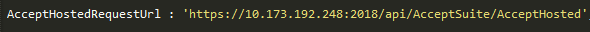
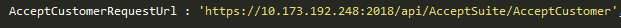
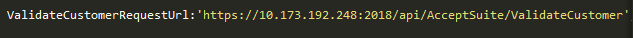
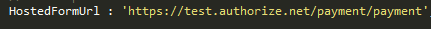
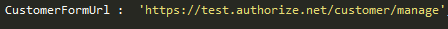

# Accept Suite Integration with .Net Core WEB API

One Paragraph of project description goes here

## Getting Started

These instructions will get you a copy of the project up and running on your local machine for development and testing purposes. See deployment for notes on how to deploy the project on a live system.

## Pre-requisites to work on donet Authorize.Net suite

The below are the pre-requisites .
*	Windows 10 professional
*	Internet information services 10

## Very detailed explanation of each product type.
Authorized.Net Accept suite has below products.
*	Accept JS
*	Accept UI
*	Accept Hosted
*	Accept Customer

Detailed explanation of each product are available in the below links.
https://developer.authorize.net/api/reference/features/accept.html
https://developer.authorize.net/api/reference/features/acceptjs.html
https://developer.authorize.net/api/reference/features/accept_hosted.html
https://developer.authorize.net/api/reference/features/customer_profiles.html#Using_the_Accept_Customer_Hosted_Form

## Integration
Constants.js file consists of required URLs that are used for WEB API calls and constant parameters that are used throughout the application.

Below are the URLs that are passed as parameters in script through Ajax calls to invoke the respective WEB API. For this the web service application should be hosted locally and IP address has to be provided in the URL path. 

* AcceptJSRequestUrl : URL to invoke Accept JS web service on payment.

* AcceptHostedRequestUrl : URL to get the token value for Accept Hosted.

* AcceptCustomerRequestUrl : URL to get the token value for Accept Customer.

* ValidateCustomerRequestUrl : URL to invoke a web api method to validated customer ID.

 
Below URLs are used to submit form with token value inorder to load the payment form.

* HostedFormUrl : Used for Accept Hosted form.

* CustomerFormUrl : Used for Accept Customer form.

 
The following are the parameters with values that remains constant throughout the application. These parameters are used in script through Ajax calls for performing payments.

* ClientKey 
* ApiLoginID
* ApiTransactionKey

The IframeCommunicator page acts as a medium to communicate with the iframe and our page.

* IFrameCommunicatorUrl : Path to IframeCommunicator page. 
