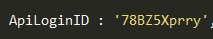
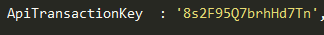
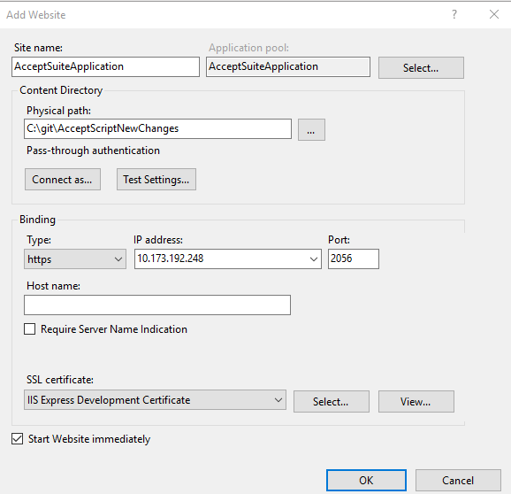

# Deploy Accept Suite .Net Application

## Very detailed explanation of each product type.

Authorized.Net Accept suite has below products.
*	Accept JS
*	Accept UI
*	Accept Hosted
*	Accept Customer

Detailed explanation of each product are available in the below links.
https://developer.authorize.net/api/reference/features/accept.html
https://developer.authorize.net/api/reference/features/acceptjs.html
https://developer.authorize.net/api/reference/features/accept_hosted.html
https://developer.authorize.net/api/reference/features/customer_profiles.html#Using_the_Accept_Customer_Hosted_Form

## Two ways to deploy Accept Suite .Net Application

## [Manual Deployment](https://github.com/kapilkumar99/accept-sample-app-dotnet#Step-by-Step-Guide-for-Manual-Deployment)
## [Automatic Deployment](https://github.com/kapilkumar99/accept-sample-app-dotnet#Step-by-Step-Guide-for-Automatic-Deployment)

## Step by Step Guide for Manual Deployment:

## Prerequisite:
*	Windows 10 Professional OS.
*	Sublime Text or any HTML editor.
*	Internet Information Services 10.

## Steps to download the code from the repository:

* Click on Clone or Download button from the repository.

* Popup Displays 2 Options Open in Desktop or Download ZIP

* Click on Download ZIP and choose the folder C:\GitHub to save.

* UnZip the folder accept-sample-app-dotnet-master.zip

* Once UnZipped , accept-sample-app-dotnet-master Folder contains css, js , HTML files along with few folders.

 

* Open the folder **AcceptSuite-DotNetCore-WebAPI**

* [Detailed steps are explained on how to deploy on IIS.](https://github.com/kapilkumar99/accept-sample-app-dotnet/tree/master/AcceptSuite-DotNetCore-WebAPI#accept-suite)

* Once deployed Successfully , update the URL's in Constants.js file as described below.

* **Constants.js file contains Keys which is used globally across the application.**

## API URL's Section:

The URLs should be provided with static port number in the following format.

**https://localhost:4403/api/AcceptSuite/ApiMethodName **

* ** ApiMethodName ** parameter is dynamic and that need to be replaced with Product Type name 
detailed description is explained below.

* AcceptJSRequestUrl/AcceptUI.JS RequestUrl : URL to invoke Accept JS web service.

	**Sample URL: https://localhost:4403/api/AcceptSuite/AcceptJS**

* AcceptHostedRequestUrl : URL to get the token value for Accept Hosted.

	**Sample URL: https://localhost:4403/api/AcceptSuite/AcceptHosted**

* AcceptCustomerRequestUrl : URL to get the token value for Accept Customer.

	**Sample URL: https://localhost:4403/api/AcceptSuite/AcceptCustomer**

* ValidateCustomerRequestUrl : URL to invoke a web api method to validate customer ID.

	**Sample URL: https://IPAddress:4403/api/AcceptSuite/ValidateCustomer**
 
 
## Merchant Authentication Details:

The following are the parameters with values that remains constant throughout the application. These parameters are used in script through Ajax calls for performing payments.

* ** Initially default sandbox credentials are provided, User can update his own Credentials. **

* ClientKey 

* ApiLoginID

* ApiTransactionKey

### Create Website on IIS

*	Open IIS as Administrator.

*	Right click on sites and select “Add Website”. 

*	Provide Site name and physical path to the app’s deployment folder(C:\inetpub\wwwroot\Publish)

*	Choose https binding.

* 	Select SSL Certificate from drop down.

*   Click OK.

	

## browse the website

Sample URL: https://localhost:4404/index_all.html

## Step by Step Guide for Automatic Deployment

## Prerequisite:

*	Windows 10 Professional OS.

*	Windows PowerShell.

*	Internet Information Services 10.

*   [IIS configuration](https://github.com/kapilkumar99/accept-sample-app-dotnet/tree/master/AcceptSuite-DotNetCore-WebAPI#iis-configuration)

*   Please check if any website on IIS is hosted on Ports ** 4403,4404 ** if available please delete the existing ports.

*	[Install the .NET Core Hosting Bundle](https://github.com/kapilkumar99/accept-sample-app-dotnet/tree/master/AcceptSuite-DotNetCore-WebAPI#install-the-net-core-hosting-bundle)

*	[Proxy Configuration](https://github.com/kapilkumar99/accept-sample-app-dotnet/tree/master/AcceptSuite-DotNetCore-WebAPI#proxy-configuration)

# Steps to run the bat file after downloading the code

* Click on Clone or Download button from the repository.

* Popup Displays 2 Options Open in Desktop or Download ZIP

* Click on Download ZIP and choose the folder C:\GitHub to save.

* UnZip the folder accept-sample-app-dotnet-master.zip

* Once UnZipped , accept-sample-app-dotnet-master Folder contains css, js , HTML files along with few folders.

* ** Before running bat file its mandatory to follow all the prerequisite steps.**

* Run deploy.bat file as Administrator.

* bat file internally will take the commands from Deploy.ps1 file and will host the Accept Suite Application.

* Once batch file successfully execute it will automatically launch the Accept Suite URL: https://localhost:4404/Index_all.html in Chrome Browser.

